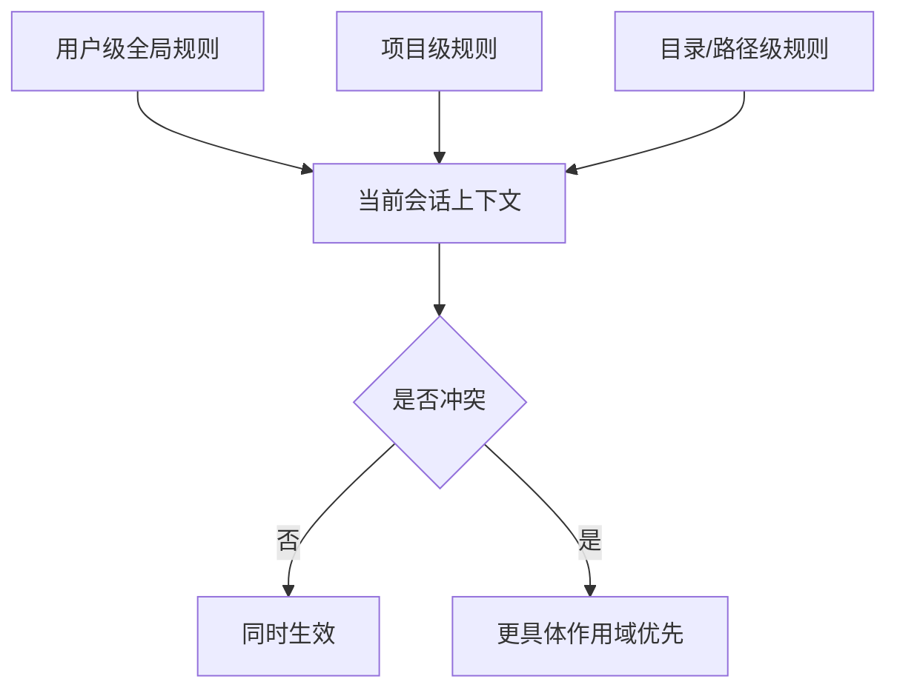

# best-rules

通用高质量项目规则（Rules）合集，可复制到 Claude Code、Codex、Cursor、VS Code Copilot 等支持 Rules 的 AI 编程工具使用。

## 什么是 Rules

**Rules**（项目规则）本质上是「开发规范/约束提示」，指导 AI 在写代码或生成文件时遵循的规范。类似 Prompt，但规则是持久的，在全局或项目范围内生效。不同工具的叫法略有差异（Cursor 称 Rules，Claude Code 称 CLAUDE.md，Codex 称 AGENTS.md），用法类似。

## 规则类型

1，**全局规则（User Rules）**：适用于所有项目

> - Claude Code：`~/.claude/CLAUDE.md`
> - Codex / OpenCode：`~/.codex/AGENTS.md`
> - Github Copilot：`~/.github/copilot-instructions.md`
> - Cursor：Cursor Settings > Rulse,Skills,Subagents > User > Rules

2，**项目规则（Project Rules）**：只对特定项目生效

> - Claude Code：`CLAUDE.md`
> - Codex / OpenCode：`AGENTS.md`
> - Github Copilot：`AGENTS.md`
> - Cursor：`AGENTS.md` 或 `.cursor/rules/*.mdc`
>

## 为什么需要 Rules

- 代码风格不统一（缩进、命名、注释）
- 技术栈约束（如只允许 React 18）
- 项目结构约定（组件放 `/components`、API 放 `api.ts`）
- 安全与团队规范（不能明文 API Key、遵循 ESLint）

## 使用 Rules 的风险

| 风险 | 说明 | 建议 |
|------|------|------|
| **过度约束** | 规则过多或过严，可能限制 AI 的创造性，生成过于僵化的代码 | 只保留核心约束，非关键项可放宽 |
| **规则冲突** | 多条规则相互矛盾时，AI 可能无所适从 | 合并或精简规则，避免重复与冲突 |
| **规则过时** | 技术栈升级后规则未更新，反而误导 AI | 随项目演进定期审查与更新 |
| **上下文占用** | 规则会占用 token 上下文，可能挤掉其他有用信息 | 控制规则篇幅，按需启用 |
| **误判适用** | 规则可能在不该生效的场景被触发 | 使用 glob 等条件限定适用范围 |
| **维护成本** | 规则需要随团队规范、工具变化持续维护 | 从少量规则起步，逐步迭代 |

## Rules 的作用域（2026/04 更新）

> 先说结论：**主流工具基本都是“多层规则拼接”，不是单层覆盖。**
>
> 当规则冲突时，通常遵循同一个原则：**离当前任务更近、作用域更具体的规则优先**。

### 一图看懂规则作用域



### 四个工具的最新作用域要点

- **Claude Code**：以 `CLAUDE.md` 体系为核心（全局 + 项目 + 目录）；规则会随项目上下文逐步命中，不是把所有说明一次性硬塞进上下文。
- **Codex / OpenCode**：以 `AGENTS.md` 为核心，通常也是“全局规则 + 项目规则”两层协同。
- **GitHub Copilot**：仓库级 `.github/copilot-instructions.md` 之外，支持 `.github/instructions/*.instructions.md` 配合 `applyTo` 做路径级约束。
- **Cursor**：以 `.cursor/rules/` 为主；规则类型分为 Always / Auto Attached / Agent Requested / Manual。实操上是“全局 + 项目 + 按类型触发”的组合。

## 编写规则要点

1. **项目背景**：项目信息、目标、技术栈
2. **编码标准**：命名、注释、风格
3. **库和框架约束**：版本、禁止项
4. **文件结构**：目录约定
5. **文档规范**：JSDoc、docstring 等
6. **安全规范**：敏感信息、`.env` 等

## 规则编写约束

为了保证规则长期可维护，新增规则时遵循以下约束：

1. **规则尽量短小、具体、可执行**
   - 优先写明确约束，如“使用 TypeScript”“提交前先验证主路径”
   - 不写空泛表述，如“保持高质量”“遵循最佳实践”

2. **优先拆分组合，不写大而全单文件**
   - 全局原则放 `global.md`
   - 技术栈约束放 `rules/stacks/*.md`
   - 任务方法论放 `rules/scenarios/*.md`

3. **只有高频且边界清晰的内容才新增规则**
   - 能明显减少返工、误判、冲突时才值得新增
   - 与现有规则高度重叠的内容，不单独建文件

4. **规则要避免冲突和重复**
   - 同一约束只保留一个权威位置
   - stack 规则不重复 scenario 方法论
   - scenario 规则不重复全局原则

5. **能限定范围时，不要无条件全局生效**
   - 优先使用 frontmatter 的适用范围约束
   - 只对确实应长期生效的规则使用 alwaysApply

6. **规则更新优先于实现补丁**
   - 如果问题本质是约定缺失、边界不清或规则冲突，先修规则，再修实现

## 规则文件组织

推荐按 **global + stack + scenario** 组合使用：

- `rules/global.md`：全局通用约束
- `rules/stacks/*.md`：按技术栈划分的规则
- `rules/scenarios/*.md`：按任务场景划分的方法论规则

这样可以把“通用原则”“技术栈约束”“当前任务类型”拆开维护，减少重复和冲突。

### 目录结构

```text
rules/
├── global.md
├── stacks/
│   ├── react.md
│   ├── vue3.md
│   ├── python.md
│   ├── cpp.md
│   ├── rust.md
│   ├── go.md
│   ├── qt.md
│   └── pyqt.md
└── scenarios/
    ├── bugfix.md
    ├── feature.md
    ├── refactor.md
    └── code_review.md
```

### 通用规则
[🔥rules/global.md](rules/global.md)

### 技术栈规则

| 技术栈 | 文件 | 适用 glob |
|--------|------|-----------|
| React | [react.md](rules/stacks/react.md) | `src/**/*.{ts,tsx}` |
| Vue 3 | [vue3.md](rules/stacks/vue3.md) | `src/**/*.vue` |
| Python | [python.md](rules/stacks/python.md) | `src/**/*.py` |
| C++ | [cpp.md](rules/stacks/cpp.md) | `src/**/*.cpp`, `src/**/*.h` |
| Rust | [rust.md](rules/stacks/rust.md) | `src/**/*.rs` |
| Go | [go.md](rules/stacks/go.md) | `src/**/*.go` |
| Qt | [qt.md](rules/stacks/qt.md) | `src/**/*.cpp`, `src/**/*.h`, `src/**/*.ui` |
| PyQt | [pyqt.md](rules/stacks/pyqt.md) | `src/**/*.py` |

### 场景规则

| 场景 | 文件 | 用途 |
|------|------|------|
| Bug Fix | [bugfix.md](rules/scenarios/bugfix.md) | 聚焦复现、定位、修复与回归验证 |
| Feature | [feature.md](rules/scenarios/feature.md) | 聚焦需求边界、最小实现与功能验收 |
| Refactor | [refactor.md](rules/scenarios/refactor.md) | 聚焦边界控制、渐进式重构与等价验证 |
| Code Review | [code_review.md](rules/scenarios/code_review.md) | 聚焦风险识别、证据驱动反馈与 review 结论 |

## 规则官方文档

> - Claude Code Rules：https://code.claude.com/docs/zh-CN/memory
> - Codex Rules：https://developers.openai.com/codex/guides/agents-md
> - OpenCode Rules：https://opencode.ai/docs/zh-cn/rules/
> - Github Copilot Rules：https://code.visualstudio.com/docs/copilot/customization/custom-instructions
> - Cursor Rules：https://cursor.com/cn/docs/rules

## 友链

- [Linux.do](https://linux.do/)